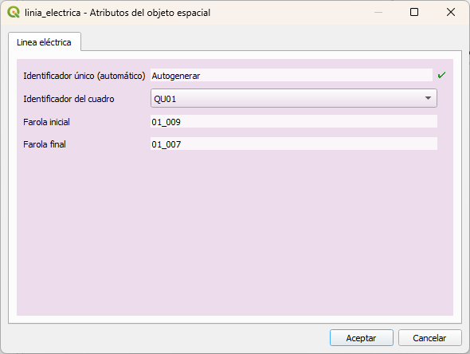

# TALLER FORMULARIOS DE QGIS  

# JORNADAS SIG LIBRE GIRONA 2023


## RESUMEN
En este taller vamos a ver diversas opciones para manejar el formulario de atributos de las capas en QGIS
1. Diseño de arrastras y soltar (Drag and Drop designer)
2. Relación de valores
3. Relación de valores con filtro
4. Valores por defecto
5. Añadir condicionales 
6. Mostrar una imágen


#### Descargar este fichero zip con capas y fotos, descomprimirlo!!!!!
https://github.com/carlospsig/jornadassiglibre_2023/blob/b4acab95c73cd4c3de84f5a1f91c36e4b54b4ecc/Taller_formularios.zip


## Primero abrimos un proyecto de QGIS preparado
Cargar prpyecto de GeoPackage
- Menú Proyecto --> Abrir Formulario --> GeoPacakge --> 


## Diseño de arrastar y soltar
Vamos a las propiedades de la capa de linees electricas o tendido eléctrico

Capa activca --> Menú contextual (botón derecho del ratón) --> Propiedades de la capa --> Formulario de atributos

1- Definimos el tipo de formulario como "Diseño de arrastrar y soltar
2- Creamos un tabulador con nombre "Lineas eléctrica"
3- Añadimos todos los campos a este tabulador
   - id == no editable
   - id_cuadro = Relación de valores
   - farola_inicial = No editable -- Valor por defecto el código de la farola que conecta al inicio de la línea
   - farola_final = No editable -- Valor por defecto el código de la farola que conecta al final de la línea
   - longitud = No editable -- Valor por defecto, longitud de la línea con 2 decimales





### Farola incial
```
aggregate(
   layer:='Farolas', 
   aggregate:= 'concatenate', 
   expression:= "id_farola", 
   filter:= intersects(buffer(start_point(geometry(@parent)),0.01), $geometry) )
```

### Farola final
```
aggregate(
   layer:='Farolas', 
   aggregate:= 'concatenate', 
   expression:= "id_farola", 
   filter:= intersects(buffer(end_point(geometry(@parent)),0.01), $geometry) )
```

### Longitud
```
round($length , 2)
```

### id_cuadro
Relación de valors utilizando la capa de cuadrod y el codi de cuadro como id y como valor

Pero añadiremos un filtro, en la Epsilon
```
intersects( buffer($geometry, 200) ,  @current_geometry )
```


