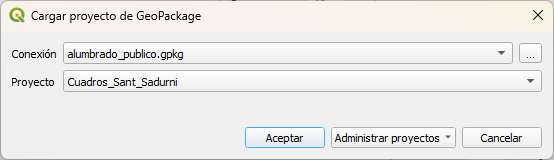

# TALLER FORMULARIOS DE QGIS  

# JORNADAS SIG LIBRE GIRONA 2023

## RESUMEN
En este taller vamos a ver diversas opciones para manejar el formulario de atributos de las capas en QGIS
1. Diseño de arrastras y soltar (Drag and Drop designer)
2. Relación de valores
3. Relación de valores con filtro
4. Valores por defecto
5. Añadir condicionales 
6. Mostrar una imágen

#### Descargar este fichero zip con capas y fotos, descomprimirlo!!!!!
https://github.com/carlospsig/jornadassiglibre_2023/blob/b4acab95c73cd4c3de84f5a1f91c36e4b54b4ecc/Taller_formularios.zip

## Primero abrimos un proyecto de QGIS preparado
Cargar prpyecto de GeoPackage
- Menú Proyecto --> Abrir Formulario --> GeoPacakge --> 

## Diseño de arrastar y soltar
